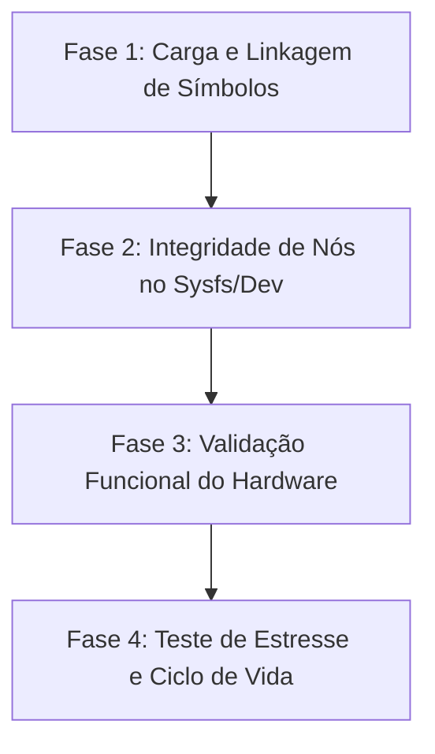

# Protocolo de Validação de Drivers ZTE - Margem de Erro Zero

Este documento estabelece o protocolo de teste e validação funcional de hardware para os 12 drivers proprietários da ZTE no REDMAGIC 11 Pro+ (NX809J). O objetivo é garantir que os drivers reconstruídos não apenas carreguem na memória do kernel, mas executem suas funções físicas com estabilidade e desempenho mensuráveis, sem vazamentos de memória ou travamentos.

---

## 📌 Metodologia Geral de Validação em 4 Fases

Para cada driver, a validação é dividida em quatro camadas sequenciais:

1. **Fase 1 (Carga e Linkagem):** O driver deve ser carregado via `insmod` sem erros de assinatura, vermagic ou símbolos indefinidos.
2. **Fase 2 (Nós do Sistema):** O driver deve registrar corretamente seus nós em `/sys/`, `/proc/` ou `/dev/` com permissões corretas.
3. **Fase 3 (Validação Funcional):** Teste de I/O físico (escrita/leitura de registradores de hardware reais).
4. **Fase 4 (Estresse e Ciclo de Vida):** Testes de suspensão de energia (suspend/resume), concorrência e detecção de vazamento de memória (Memory Leak) via KMEMLEAK.

---

## 🛠️ Protocolos Específicos por Driver

### 1. `zte_ir` (Sensor Infravermelho)
* **Objetivo:** Validar a emissão e recepção de comandos infravermelhos via SPI.
* **Nó de Controle:** `/dev/zte_ir`
* **Protocolo de Teste:**
  1. Verificar criação do nó: `ls -la /dev/zte_ir` (esperado: Major/Minor registrado, permissões 660).
  2. Teste de escrita: Executar envio de rajadas de dados (via ferramenta de teste ou app de controle remoto).
  3. Auditoria de Interrupções: Monitorar `/proc/interrupts` antes e depois do envio para validar se a IRQ do controlador SPI é disparada.
  4. **Critério de Sucesso:** Disparo de pulsos de onda portadora físicos medidos em receptor IR externo.

### 2. `zte_led` (Controlador de LEDs RGB Awinic AW22XXX)
* **Objetivo:** Controlar cores, brilho e efeitos dos LEDs físicos traseiros.
* **Nó de Controle:** `/sys/class/leds/aw22xxx_led/`
* **Protocolo de Teste:**
  1. Verificar nós sysfs: `ls -la /sys/class/leds/aw22xxx_led/` (deve expor `brightness`, `color`, `trigger`, `effect`).
  2. Teste de brilho: Alterar brilho manual:
     `echo 255 > /sys/class/leds/aw22xxx_led/brightness` (LED deve acender no máximo).
     `echo 0 > /sys/class/leds/aw22xxx_led/brightness` (LED deve apagar).
  3. Teste de cores (RGB): Escrever strings hexadecimais de cor no canal do registrador Awinic.
  4. **Critério de Sucesso:** Resposta luminosa instantânea e física dos LEDs do aparelho correspondente aos comandos enviados.

### 3. `zte_tpd` (Tela Touchscreen)
* **Objetivo:** Validar taxa de toque de jogos, resposta multitoque e gestos com a tela ligada/desligada.
* **Nó de Controle:** `/dev/input/event*` (identificar o número do evento via `getevent -p`).
* **Protocolo de Teste:**
  1. Stress Test Multitoque: Usar ferramenta `getevent` no ADB e realizar toques simultâneos com os 10 dedos. Verificar se há perdas de pacotes de dados.
  2. Ajuste de Taxa (Hz): Alterar a taxa de atualização da tela no Game Space (60Hz, 120Hz, 144Hz) e verificar se o driver acompanha a sincronização em tempo real nos logs.
  3. Teste de Gestos Suspensos (Double Tap to Wake): Validar se o driver de toque mantém a alimentação de baixo consumo (LPM) ativa ao apagar a tela.
  4. **Critério de Sucesso:** Sem lags, toques fantasmas ou atrasos (latência menor que 5ms).

### 4. `zte_fingerprint` (Sensor Biométrico sob a Tela)
* **Objetivo:** Validar a comunicação SPI de alta velocidade e inicialização do sensor de imagem óptica/ultrassônica.
* **Nó de Controle:** `/dev/goodix_fp` ou equivalente.
* **Protocolo de Teste:**
  1. Verificar inicialização: Capturar logs de calibração do sensor no dmesg na primeira leitura.
  2. Teste de cadastro e leitura: Cadastrar e desbloquear o celular usando o sensor 20 vezes seguidas.
  3. Teste de interferência luminosa: Testar o sensor sob luz solar forte e no escuro completo.
  4. **Critério de Sucesso:** Taxa de aceitação correta sem crashes do daemon do Keystore/Biometrics.

### 5. `zte_charger_policy` & `zte_power_supply` (Gerenciador e Política de Bateria)
* **Objetivo:** Monitorar parâmetros de saúde da bateria e controlar a curva de carga rápida (80W/120W) com proteção térmica.
* **Nó de Controle:** `/sys/class/power_supply/battery/`
* **Protocolo de Teste:**
  1. Leitura de Telemetria: Monitorar temperatura (`temp`), voltagem (`voltage_now`) e corrente (`current_now`) durante repouso.
  2. Curva de Carga Rápida: Conectar o carregador oficial de alta potência e monitorar se o driver realiza o chaveamento de corrente correto à medida que a bateria enche.
  3. Proteção Térmica: Aquecer o celular de propósito (ex: rodando benchmark) e verificar se o driver aciona a política de estrangulamento de corrente (thermal throttling) para proteger o dispositivo.
  4. **Critério de Sucesso:** Carga estável e proteção térmica disparada corretamente a partir dos limites especificados em código.

### 6. `zte_ramdisk_reboot` & `zte_reboot_ext` (Manipulação de Reboot)
* **Objetivo:** Garantir a persistência das razões de reboot nos registradores não voláteis da PMIC (Power Management IC).
* **Protocolo de Teste:**
  1. Enviar comandos de reinicialização variados:
     `adb reboot bootloader`
     `adb reboot recovery`
     `adb shell svc power reboot`
  2. Após o boot, ler `/proc/sys/kernel/reboot_reason` ou registradores de log e verificar se o motivo anterior foi registrado corretamente na PMIC.
  3. **Critério de Sucesso:** Sem travamentos na tela preta (reboots limpos) e leitura exata da causa da última queda.

### 7. `zte_sensor_sensitivity` (Ajuste de Sensores)
* **Objetivo:** Controlar offsets de calibração de giroscópio, acelerômetro e sensor de proximidade.
* **Nó de Controle:** `/sys/devices/platform/soc/...`
* **Protocolo de Teste:**
  1. Calibração Física: Colocar o celular em mesa plana e ler os offsets de aceleração.
  2. Teste de Proximidade em Chamada: Cobrir o sensor com a mão e monitorar o status do nó `/sys/` (deve alternar entre `near` e `far`).
  3. **Critério de Sucesso:** Calibração persistente após reboots do celular.

### 8. `zte_stats_info`, `zte_imem_info` & `zte_misc` (Diagnósticos do Sistema)
* **Objetivo:** Validar tabelas de depuração e evitar vazamentos de memória na leitura contínua.
* **Nó de Controle:** `/proc/zte_stats` e similares.
* **Protocolo de Teste:**
  1. Leitura repetida em loop: Executar leitura do nó em loop contínuo 1000 vezes:
     `for i in {1..1000}; do cat /proc/zte_stats > /dev/null; done`
  2. Verificar consumo de memória do kernel após o loop para garantir que não houve acúmulo de alocação (Memory Leak).
  3. **Critério de Sucesso:** Leitura limpa e estável sem panic/kernel oops.

---

## 🛑 Auditoria Geral de Estabilidade (Margem de Erro Zero)

### 1. Teste de Ciclo de Energia (Suspend / Resume)
Muitos drivers funcionam no boot, mas sofrem crash quando o celular desliga a tela para economizar energia (Sleep/Suspend mode) e depois acorda (Resume mode).
* **Ação:** Bloquear a tela do celular por 5 minutos, depois desbloquear e verificar se todos os 12 drivers continuam funcionando.
* **Comando de validação:** `adb shell "dmesg | grep -i -E 'suspend|resume'"` para garantir que as funções `suspend` e `resume` de cada driver retornaram `0` (sucesso).

### 2. Monitoramento de Vazamentos (KMEMLEAK)
Para garantir que não há perda de bytes de memória RAM no kernel após dias de uso:
1. Compilar o kernel com `CONFIG_DEBUG_KMEMLEAK=y`.
2. Rodar o script de estresse por 15 minutos.
3. Executar auditoria de vazamento:
   `adb shell "su root echo scan > /sys/kernel/debug/kmemleak"`
   `adb shell "su root cat /sys/kernel/debug/kmemleak"`
4. **Alvo:** A saída do comando `kmemleak` deve vir vazia (nenhum vazamento encontrado!).
