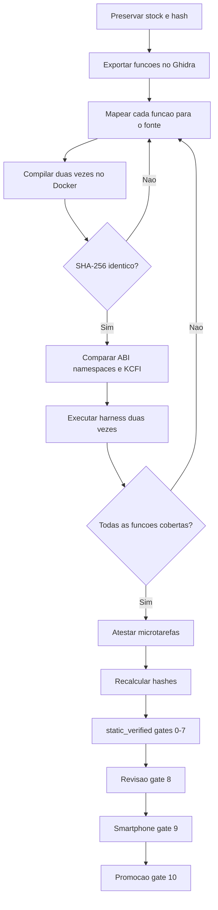

# Guia do Harness e da Atestacao de Microtarefas

Este documento explica, para engenheiros em inicio de carreira, como validar um driver reconstruido antes de testa-lo no smartphone. O exemplo real e o `zte_fingerprint`, reconstruido a partir do modulo stock do ZTE NX809J.

> Regra principal: um arquivo `.ko` compilado sem erros ainda nao prova que o driver foi reconstruido corretamente.

## 1. O que foi feito com o ultimo arquivo compilado

O `zte_fingerprint.ko` passou pelo seguinte ciclo:

1. Compilacao limpa, do zero, duas vezes no Docker.
2. Confirmacao de que as duas builds produziram o mesmo SHA-256.
3. Auditoria de simbolos importados, aliases, namespaces e `vermagic`.
4. Analise do `.ko` final no Ghidra e comparacao das 30 funcoes com o stock.
5. Comparacao KCFI das 12 funcoes usadas em fronteiras indiretas.
6. Execucao de um harness de host cobrindo as 30 funcoes e caminhos de erro.
7. Atestacao das 30 microtarefas com evidencias de build, KCFI, teste e hash.
8. Recalculo dos hashes por um verificador separado do atestador.
9. Promocao da build fresca para `curated` somente depois da aprovacao.

| Campo | Valor |
|---|---|
| Arquivo | `zte_fingerprint.ko` |
| Tamanho | `393336` bytes |
| SHA-256 | `553846049bafaf30e0e7ee0349f08f0b168c93a96cdc1b0b44ae8b2264f94b34` |
| Inventario Ghidra | `30/30` funcoes |
| Fronteiras KCFI | `12/12` |
| Microtarefas | `30/30` |
| Estado correto | `static_verified` |

Esse estado nao significa "100% validado em hardware". Os gates de revisao independente, teste supervisionado no aparelho e promocao final continuam separados.

## 2. Por que o harness existe

Um modulo pode compilar e ainda conter erros no ciclo de vida, callbacks, `ioctl`, IRQ, GPIO, reguladores ou limpeza de recursos. Descobrir isso diretamente no aparelho pode causar reboot, travamento ou perda temporaria do ADB.

O harness compila o mesmo fonte em modo `ZTE_FINGERPRINT_HOST_TEST`. O arquivo `tests/host_stubs.h` substitui de forma controlada servicos como:

- GPIO, IRQ, input e regulator;
- Netlink e notificadores de painel;
- class, device, workqueue e wakeup source;
- ZLOG;
- injecao de falhas para testar os caminhos de cleanup.

O runner produz e executa dois binarios e exige:

- compilacao com `-Wall -Wextra -Werror`;
- retorno zero e todas as assercoes aprovadas;
- cobertura declarada para as 30 funcoes;
- o mesmo SHA-256 nos dois executaveis.

O harness nao carrega o `.ko`, nao executa `insmod`, nao faz unbind do driver stock e nao toca no smartphone. Ele reduz risco, mas nao simula eletricamente o sensor e nao substitui o teste fisico.

## 3. O que sao as 30 microtarefas

O Ghidra encontrou 30 funcoes no modulo stock. O pipeline gera uma microtarefa por funcao para impedir que uma implementacao grande seja declarada pronta enquanto funcoes menores ficam sem verificacao.

| Evidencia | O que comprova |
|---|---|
| `compile.json` | O fonte participou de uma build limpa e reproduzivel. |
| `kcfi.json` | O type ID coincide com o stock ou existe uma decisao N/A explicita. |
| `test.json` | A funcao foi exercitada por um caso de teste identificado. |

No `zte_fingerprint`, 12 funcoes possuem fronteira indireta KCFI real. As outras 18 sao chamadas diretamente; elas nao sao ignoradas, mas recebem a decisao auditavel "KCFI nao aplicavel".

`attest_driver_microtasks.py` somente marca `PASS` quando build, KCFI e harness estao aprovados e todas as funcoes aparecem na cobertura. Depois, `verify_driver_microtasks.py` recalcula os hashes para detectar arquivos alterados ou evidencias antigas.

## 4. Gates obrigatorios

| Gate | Validacao |
|---|---|
| 0 | Seguranca, custodia e rollback. |
| 1 | Modulo stock preservado e identificado por hash. |
| 2 | Export e inventario do Ghidra. |
| 3 | Mapa stock para fonte, funcao por funcao. |
| 4 | ABI, imports, namespaces e KCFI. |
| 5 | Microtarefas e testes atomicos. |
| 6 | Build limpa, reproduzivel e compatibilidade KMI. |
| 7 | Paridade estatica e comportamental no harness. |
| 8 | Revisao independente. |
| 9 | Validacao supervisionada no hardware. |
| 10 | Promocao final e registro de release. |

Os gates 0 a 7 permitem `static_verified`. A afirmacao "100% reconstruido" somente e permitida quando os gates 0 a 10 possuem evidencias aprovadas.

## 5. Esse processo e sempre necessario?

Neste projeto, sim: todo driver vendor reconstruido ou out-of-tree precisa passar por esse ciclo antes de receber `static_verified`. Em outros projetos, as ferramentas podem mudar, mas as garantias equivalentes continuam necessarias.

O tamanho do trabalho acompanha o driver. Um modulo pequeno gera menos microtarefas e um harness menor; IRQ, DMA, concorrencia ou acesso a hardware exigem testes mais profundos. "Driver simples" nao e justificativa para pular rastreabilidade, build reproduzivel ou caminhos de erro.

Harness e smartphone respondem perguntas diferentes:

- o harness verifica logica, contratos, falhas e cleanup de forma repetivel;
- o smartphone verifica barramento, Device Tree, firmware, temporizacao, energia, IRQ real e integracao com Android.

## 6. Como repetir a validacao

Execute a partir de `C:\Users\adriano\Desktop\emulador\kernel-docker-workspace`.

### 6.1 Executar o harness

```powershell
python .\engenharia\curated\zte_fingerprint\tests\run_host_tests.py
```

Confirme em `engenharia\validation\zte_fingerprint\host_test_report.json`: `passed: true`, dois binarios com o mesmo SHA-256, 30 entradas de cobertura e nenhum retorno diferente de zero.

### 6.2 Fazer build limpa e promover somente o resultado fresco

```powershell
python .\engenharia\tools\validate_reconstructed_drivers.py `
  --run-root .\engenharia\runs\NX809J-20260711T011653Z `
  --driver zte_fingerprint `
  --rebuild --strict --promote-fresh `
  --output .\engenharia\validation\zte_fingerprint\driver_audit_final.json
```

Exija `reproducible: true`, `candidate_matches_fresh: true`, `passed: true` e o SHA esperado.

### 6.3 Recriar Ghidra e KCFI

```powershell
python .\engenharia\tools\compare_ghidra_exports.py --help
python .\engenharia\tools\extract_kcfi.py --help
python .\engenharia\tools\compare_kcfi_reports.py --help
```

Use sempre os exports stock e candidato da execucao atual. Os resultados finais devem estar em `ghidra_stock_candidate_comparison.json` e `kcfi_callback_surface.json`, com `passed: true`, inventario `30/30` e KCFI `12/12`.

### 6.4 Atestar e verificar as microtarefas

```powershell
$kcfiNaoAplicavel = @(
  '_inline_copy_from_user', '_inline_copy_to_user', 'gf_cleanup',
  'gf_disable_irq', 'gf_enable_irq', 'gf_hw_reset', 'gf_irq_num',
  'gf_parse_dts', 'gf_power_off', 'gf_power_on',
  'goodixfp_drm_get_pannel', 'list_del', 'nav_event_input',
  'netlink_exit', 'netlink_init', 'sendnlmsg',
  'zte_goodix_pinctrl_init', 'zte_goodix_pinctrl_select'
)

$naArgs = foreach ($funcao in $kcfiNaoAplicavel) {
  '--kcfi-not-applicable'
  $funcao
}

python .\engenharia\tools\attest_driver_microtasks.py `
  --driver zte_fingerprint `
  --build-report .\engenharia\validation\zte_fingerprint\driver_audit_final.json `
  --test-report .\engenharia\validation\zte_fingerprint\host_test_report.json `
  --kcfi-report .\engenharia\validation\zte_fingerprint\kcfi_callback_surface.json `
  --engineering-root .\engenharia `
  @naArgs

python .\engenharia\tools\verify_driver_microtasks.py `
  --driver zte_fingerprint `
  --curated-root .\engenharia\curated `
  --evidence-root .\engenharia\validation
```

O verificador deve terminar com 30 tarefas verificadas e zero falhas.

### 6.5 Verificar o ciclo global

```powershell
python .\engenharia\tools\verify_llm_reconstruction_cycle.py `
  --driver zte_fingerprint `
  --curated-root .\engenharia\curated `
  --run-root .\engenharia\runs\NX809J-20260711T011653Z `
  --evidence-root .\engenharia\validation `
  --audit .\engenharia\validation\zte_fingerprint\driver_audit_final.json
```

Troque o `run-root` quando iniciar uma nova aquisicao. `cycle_validation.json` e `CYCLE_VALIDATION.md` devem ser regenerados, nunca editados para converter falha em sucesso.

## 7. Quando invalidar e repetir evidencias

Repita build, Ghidra, KCFI, harness e atestacao quando mudar qualquer item abaixo:

- fonte `.c` ou cabecalho `.h`;
- `Makefile`, flags, toolchain ou configuracao do kernel;
- stubs, testes ou mapa de reconstrucao;
- modulo stock de referencia;
- Device Tree, ABI/KMI ou dependencia vendor.

Uma alteracao de comentario que nao muda o binario ainda deve gerar um novo registro da revisao. Nunca reutilize evidencias sem confirmar os hashes.

## 8. Criterios de parada

Interrompa a promocao quando:

- uma funcao stock nao estiver no `reconstruction_map.json`;
- as duas builds produzirem hashes diferentes;
- existir import ou namespace inesperado;
- um type ID KCFI nao coincidir;
- uma microtarefa estiver sem evidencia;
- o harness falhar ou nao cobrir uma funcao;
- o `.ko` em `curated` nao coincidir com a build fresca;
- o teste fisico nao tiver rollback.

Nunca altere manualmente `passed`, `status` ou hashes nos JSON. Corrija a causa e gere os relatorios novamente.

## 9. Validacao segura no smartphone

O gate fisico deve ocorrer em janela supervisionada, com imagem stock, ADB/fastboot e rollback confirmados. O harness nao autoriza automaticamente `insmod`, unbind, unload ou substituicao do driver stock.

Antes do teste, registre kernel e slot ativos, hash do modulo, bindings atuais, logs iniciais, comandos de rollback, timeout e criterios de sucesso. Depois, capture `dmesg`, estado do barramento, bindings, eventos funcionais e resultado do rollback. Somente essas evidencias concluem o gate 9.

## 10. Mapa rapido



## 11. Arquivos de referencia

- Fonte e harness: `kernel_development/drivers/reconstructed/zte_fingerprint/`
- Evidencias: `reverse_engineering/validation/reconstructed/zte_fingerprint/`
- Protocolo: `workspace_tools/reconstruction_pipeline/LLM_MANDATORY_RECONSTRUCTION_CYCLE.md`
- Manifesto: `kernel_development/drivers/reconstructed/zte_fingerprint/MICROTASKS.json`
- Rastreabilidade: `kernel_development/drivers/reconstructed/zte_fingerprint/reconstruction_map.json`

O processo torna cada afirmacao tecnica verificavel, repetivel e ligada ao binario exato que sera testado.
