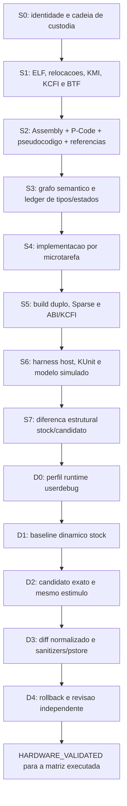

# Tecnicas Avancadas para Reconstrucao de Drivers Android GKI 6.12

Pesquisa tecnica concluida em **2026-07-15**. Este documento aplica metodos
publicos e oficiais ao ambiente preservado do **ZTE NX809J, REDMAGIC 11 Pro+**,
Android 16, kernel `6.12.23-android16` e ROM userdebug.

## 1. Escopo e regra de evidencia

Documentacao publica define como Linux, Android, GKI, Clang, Ghidra e QEMU
funcionam. Ela nao define o comportamento privado do NX809J. Para qualquer fato
do aparelho, a ordem de autoridade continua sendo:

1. `.ko`, imagens, DTB/DTBO, firmware e configuracao extraidos localmente, com
   SHA-256;
2. ELF, secoes, relocacoes, modversions, KCFI, BTF, strings e aliases do mesmo
   binario;
3. Assembly AArch64, P-Code e pseudocodigo Ghidra vinculados ao mesmo hash;
4. fonte candidato, build, harnesses e relatorios reproduziveis;
5. observacao dinamica A/B na ROM userdebug, quando a fase de hardware for
   autorizada;
6. documentacao oficial apenas para interpretar mecanismos genericos.

Codigo da Internet para outro produto, SoC ou versao nao pode preencher um
offset, `compatible`, registrador, assinatura, GPIO ou sequencia do NX809J.

## 2. Conclusoes da pesquisa

### 2.1 GKI muda o alvo da reconstrucao

O GKI move suporte de SoC e placa para modulos vendor carregaveis e expoe uma
KMI estavel. Portanto, o objetivo correto nao e recriar um driver como se ele
estivesse dentro do kernel principal. O candidato precisa:

- permanecer fora da arvore, no dominio `vendor_dlkm`;
- usar apenas simbolos permitidos pela KMI ou hooks vendor documentados;
- preservar CRCs de modversions, namespaces e assinaturas de callback;
- respeitar KCFI, politica de assinatura e protecoes vendor;
- ser compilado contra o ACK, `.config`, `Module.symvers` e Clang fixados.

O monitoramento ABI do Android compara representacoes extraidas de `vmlinux` e
modulos, atualmente com STG. A lista KMI inclui apenas a uniao dos simbolos
explicitamente mantidos, nao todos os simbolos exportados pelo kernel. Paridade
de nome sem CRC, tipo e namespace nao e suficiente.

Fontes: [projeto GKI](https://source.android.com/docs/core/architecture/kernel/generic-kernel-image),
[listas de simbolos](https://source.android.com/docs/core/architecture/kernel/howto-symbol-lists) e
[monitoramento ABI/KMI](https://source.android.com/docs/core/architecture/kernel/abi-monitor).
O ACK de referencia e a branch oficial
[android16-6.12](https://android.googlesource.com/kernel/common/+/refs/heads/android16-6.12/);
o release exato `6.12.23-...` deste projeto continua vindo do lock local.

### 2.2 Userdebug e uma porta de observacao, nao um bypass universal

O AOSP define `userdebug` como a variante `user` com componentes de debug,
`ro.debuggable=1`, ADB habilitado e acesso raiz para desenvolvimento. Isso nao
altera automaticamente a configuracao do kernel, nao remove SELinux, nao cria
simbolos ausentes e nao desativa KCFI ou a politica vendor de modulos.

Consequencias praticas:

- `adb root` nao prova que um `.ko` sera aceito;
- root nao contorna um type ID KCFI incorreto;
- root nao cria `FUNCTION_TRACER`, KCOV, KGDB ou fault injection;
- BPF, Kprobes, debugfs e tracefs ainda dependem de configuracao e politica em
  runtime;
- KASAN presente na `.config` ainda pode depender do modo de boot e do MTE.

Fonte: [variantes e diretrizes userdebug do AOSP](https://source.android.com/docs/setup/create/new-device#userdebug-guidelines).

### 2.3 O conjunto estatico deve ser maior que o pseudocodigo

O P-Code do Ghidra traduz instrucoes para operacoes sobre estado, varnodes e
fluxo de dados. Ele e mais adequado para construir grafos e conferir larguras,
extensoes, loads, stores e chamadas do que o texto C isolado. Mesmo assim, P-Code
nao recupera nomes, macros ou significado eletrico que nao estejam codificados.

Pacote minimo por funcao:

```text
funcao stock nome@endereco
  -> intervalo Assembly completo e relocacoes
  -> P-Code integral por instrucao
  -> pseudocodigo C individual
  -> chamadas diretas e indiretas
  -> referencias a dados, strings e tabelas de callback
  -> constantes, offsets, larguras e sinais
  -> tipo KCFI quando aplicavel
  -> funcao candidata, microtarefa e testes
```

A esteira atual ja garante a bijecao entre 647 funcoes, C decompilado, P-Code e
Assembly nos 14 candidatos publicados. O proximo salto nao e gerar mais texto C;
e enriquecer cada no com referencias de dados, relocacoes, tipos e comparacao
stock/candidato.

Fonte: [manual oficial de P-Code do Ghidra](https://ghidra.re/ghidra_docs/languages/html/pcoderef.html).

### 2.4 Tipos devem ser resolvidos por restricoes independentes

Antes de nomear uma estrutura, combinar:

1. BTF ou DWARF realmente presente no artefato;
2. prototipo e type ID KCFI de callbacks indiretos;
3. offsets, larguras, sinal e alinhamento vistos no Assembly/P-Code;
4. relocacoes para objetos globais e tabelas;
5. contratos de headers do kernel 6.12.23 fixado;
6. STG/KMI e CRCs de simbolos importados;
7. DTB/DTBO, UAPI, ioctl, netlink, sysfs e procfs;
8. invariantes observadas em mais de uma funcao.

BTF codifica tipos, tamanhos, membros e bit offsets. A configuracao local possui
`CONFIG_DEBUG_INFO_BTF=y` e `CONFIG_DEBUG_INFO_BTF_MODULES=y`, mas cada `.ko`
stock ainda precisa ser inspecionado: a configuracao nao prova que a secao `.BTF`
foi preservada naquele arquivo.

Depois da inferencia, usar `static_assert`, `sizeof`, `offsetof`, `__iomem`,
`__user`, `__rcu`, endianness explicita e Sparse. Sparse verifica classes de
tipos e contexto de locks que o compilador C comum pode aceitar silenciosamente.

Fontes: [BTF no kernel 6.12](https://docs.kernel.org/6.12/bpf/btf.html) e
[Sparse no kernel 6.12](https://docs.kernel.org/6.12/dev-tools/sparse.html).

### 2.5 KCFI e evidencia de assinatura, nao detalhe de build

KCFI foi desenhado para software de baixo nivel e valida chamadas por ponteiro
de funcao. No NX809J, `CONFIG_CFI_CLANG=y` e `CONFIG_CFI_PERMISSIVE=n`. Logo:

- todo callback de `file_operations`, `platform_driver`, SPI, I2C, notifier,
  timer, workqueue, IRQ, netlink ou sysfs precisa de prototipo exato;
- casts para silenciar erro de compilacao sao bloqueadores;
- igualdade textual de nomes nao corrige type IDs diferentes;
- a superficie KCFI precisa ser comparada stock/candidato por callback.

Fonte: [KCFI na documentacao oficial do Clang](https://clang.llvm.org/docs/ControlFlowIntegrity.html#fsanitize-kcfi).

## 3. Matriz real de observabilidade do NX809J

A matriz abaixo foi calculada de
`reproducible_environment/inputs/nx809j_kernel.config`, cujo SHA-256 coincide
com `environment.lock.json`. O relatorio completo e reproduzivel esta em
`reverse_engineering/validation/USERDEBUG_OBSERVABILITY_CAPABILITIES.md`.

| Tecnica | Estado estatico local | Decisao |
|---|---|---|
| `/proc/config.gz` | configurado | usar para provar a configuracao do boot observado |
| debugfs | configurado | montar/verificar com politica controlada |
| tracefs e tracepoints | configurado | usar eventos estaticos e latencia |
| function/function_graph tracer | parcial | nao prometer; `FUNCTION_TRACER` nao esta ativo |
| Kprobes/kretprobes | configurado | candidato forte para observacao seletiva |
| BPF + BTF + BPF events | configurado | candidato forte, sujeito a BPF LSM/SELinux |
| BTF de modulos | configurado | inspecionar `.BTF` de cada `.ko` stock |
| dynamic debug | parcial | `DYNAMIC_DEBUG_CORE` nao substitui `DYNAMIC_DEBUG` |
| perf + tracepoints | configurado | usar para frequencia e latencia |
| kallsyms completo | configurado | sujeito a `kptr_restrict` em runtime |
| pstore/ramoops | configurado | verificar reserva DT e montar pstore |
| ftrace persistente | indisponivel | exige recompilacao de kernel de laboratorio |
| HW_TAGS KASAN | configurado | confirmar ativacao, MTE e parametros de boot |
| UBSAN | configurado com trap | tratar achado como potencial reset/panic |
| KUnit | modulo | util se a politica de carga permitir |
| KCOV | indisponivel | syzkaller guiado por cobertura exige kernel de laboratorio |
| PROVE_LOCKING/lockdep | indisponivel | usar analise estatica e kernel de laboratorio |
| fault injection | indisponivel | usar wrappers/harness ou kernel de laboratorio |
| KGDB | indisponivel | nao planejar depuracao KGDB neste boot |
| KCFI | estrito | obrigatorio preservar assinaturas indiretas |
| assinatura de modulos | ativa | `MODULE_SIG_FORCE=n`, mas protecao vendor esta ativa |
| mmiotrace | arquitetura nao suportada | documentacao oficial limita a x86/x86_64 |

Gerar ou conferir a matriz:

```powershell
python .\workspace_tools\reconstruction_pipeline\audit_userdebug_observability.py --write
python .\workspace_tools\reconstruction_pipeline\audit_userdebug_observability.py --check
```

As tecnicas individuais seguem a documentacao de
[dynamic debug](https://docs.kernel.org/6.12/admin-guide/dynamic-debug-howto.html),
[ftrace](https://docs.kernel.org/6.12/trace/ftrace.html),
[Kprobes](https://docs.kernel.org/6.12/trace/kprobes.html),
[KASAN](https://docs.kernel.org/6.12/dev-tools/kasan.html),
[KUnit](https://docs.kernel.org/6.12/dev-tools/kunit/index.html),
[fault injection](https://docs.kernel.org/6.12/fault-injection/fault-injection.html),
[assinatura de modulos](https://docs.kernel.org/6.12/admin-guide/module-signing.html) e
[ramoops](https://docs.kernel.org/6.12/admin-guide/ramoops.html).

## 4. Tecnicas sofisticadas aplicaveis

### 4.1 Analise ELF orientada a relocacoes

Para um `ET_REL`, enderecos finais ainda nao existem. Relocacoes dizem qual
objeto, simbolo ou chamada o loader devera resolver. A reconstrucao deve indexar
por funcao:

- relocacao, offset no section e tipo AArch64;
- simbolo alvo, namespace, CRC e modversion;
- load/store ou callsite associado;
- objeto de dados e addend;
- divergencia stock/candidato.

Isso reduz falsos nomes produzidos pelo decompilador e identifica tabelas de
callbacks, strings de ABI e dependencias que um grafo de chamadas simples perde.

### 4.2 Grafo semantico multicamada

Construir um grafo versionado com nos:

```text
function | basic_block | external_symbol | global_object | string |
callback_table | dt_property | register_offset | userspace_endpoint
```

E arestas:

```text
calls | indirect_calls | reads | writes | takes_address | registers |
binds_to | emits | parses | owns | locks | schedules | cancels
```

Cada aresta precisa de origem: Assembly, relocacao, P-Code, BTF, DT ou trace.
Inferencias recebem `confidence` e nunca sao promovidas apenas por repeticao em
texto gerado por LLM.

### 4.3 Recuperacao de estruturas por solucao de restricoes

Gerar um ledger por base de ponteiro:

```text
base_id, origin, offset, width, signedness, access_kind, function_id,
alignment, lock_context, address_space, evidence_hash
```

O layout candidato deve satisfazer todas as linhas. Campos desconhecidos ficam
`unknown_N` ou `reserved_N`. Um nome sem evidencia nao entra no header final.

Para AArch64, conferir tambem:

- extensoes `sxt*`/`uxt*` e loads assinados;
- pares `ldp/stp` que revelam largura e alinhamento, sem assumir dois campos;
- atomicas LSE, exclusivas e memory barriers;
- PAC/BTI e preambulos KCFI;
- acesso `__iomem` por helpers ou sequencias inlined;
- lifetime e ownership em caminhos de unwind.

### 4.4 Adaptacao controlada de API para 6.12

Quando o Assembly mostra um contrato antigo ou vendor, adaptar contra os
headers fixados e registrar a transformacao. Coccinelle e apropriado para
detectar e aplicar padroes de API de forma reproduzivel; ele nao deve inventar
semantica do driver.

Fluxo:

1. identificar callsite stock e contrato observado;
2. localizar a API 6.12 no fonte fixado;
3. criar semantic patch ou regra de auditoria;
4. executar em modo `report` antes de `patch`;
5. compilar, executar Sparse e comparar ABI/KCFI;
6. registrar a justificativa no mapa da funcao.

Fonte: [Coccinelle no kernel 6.12](https://docs.kernel.org/6.12/dev-tools/coccinelle.html).

### 4.5 Oraculo diferencial stock/candidato

O teste dinamico mais forte nao pergunta apenas se o candidato carregou. Ele
executa o mesmo estimulo em duas sessoes controladas:

```text
S0 = ROM, slot, kernel, DT, firmware e configuracao registrados
A  = modulo stock + estimulo versionado + traces
B  = candidato exato + o mesmo estimulo + os mesmos traces
N  = normalizacao apenas de PID, timestamp, endereco aleatorio e campos volateis
D  = diferenca de eventos, retornos, estados e efeitos observaveis
```

Comparar:

- retorno e errno de ioctl/netlink/sysfs/procfs;
- sequencia de callbacks, workqueues, timers e notifiers;
- argumentos e retornos em probes permitidos;
- eventos de energia, clocks, regulators, IRQ e PM;
- logs, uevents e formatos de userspace;
- pstore, CFI, KASAN, UBSAN, Oops e taint;
- ordem de I/O do candidato instrumentado.

O oraculo deve rejeitar a sessao quando ROM, kernel, modulo, estimulo ou
configuracao divergem dos hashes declarados.

### 4.6 BPF/Kprobes como observadores, nao como corretivos

Usar probes pequenos e somente nos pontos necessarios. Eles devem registrar,
nao alterar argumentos, retorno ou fluxo. Cada sessao deve ter limite de tempo,
contagem de eventos e hash do programa carregado.

Prioridade:

1. tracepoints estaticos existentes;
2. BPF fentry/fexit quando o alvo e os tipos estiverem disponiveis;
3. Kprobe/kretprobe em simbolo permitido;
4. instrumentacao temporaria no candidato;
5. nunca modificar registradores ou desviar o PC para obter equivalencia.

Kprobes pode atingir muitas rotinas, mas a documentacao alerta para blacklist,
concorrencia e risco ao alterar o contexto. Neste projeto, handler que modifica
estado e proibido como evidencia de reconstrucao.

### 4.7 MMIO no AArch64 sem datasheet

`mmiotrace` nao e solucao para o NX809J: o kernel 6.12 documenta suporte somente
a x86/x86_64. Fonte:
[mmiotrace oficial](https://docs.kernel.org/6.12/trace/mmiotrace.html).

Metodo aplicavel:

1. extrair recursos e ranges do DT local;
2. identificar a origem da base MMIO no Assembly/P-Code;
3. catalogar `offset`, largura, direcao, mask, valor, barrier, delay e contexto;
4. correlacionar com clocks, reset, regulators, IRQ e estados de PM;
5. instrumentar o candidato com wrappers `readl/writel/regmap` sob uma opcao de
   laboratorio, sem mudar a ordem;
6. repetir estimulo e comparar a transcricao com invariantes stock observaveis;
7. nomear bits por efeito comprovado; manter `unknown` nos demais.

Para codigo stock com acesso inlined, Kprobes em helpers pode nao existir. Nessa
situacao, Assembly, P-Code, DT e efeitos externos continuam sendo a fonte; nao
se deve prometer uma captura MMIO completa.

### 4.8 Testes em camadas

Aplicar cada ferramenta apenas ao problema que ela realmente resolve:

| Camada | Ferramenta | Prova fornecida | Nao prova |
|---|---|---|---|
| C puro | harness host, sanitizers userspace | parsers, limites, state machine | contexto kernel/hardware |
| analise estatica | compiler warnings, Sparse, Coccinelle | tipos, anotacoes, padroes | execucao real |
| kernel isolado | KUnit | funcoes e contratos no kernel | periferico vendor ausente |
| sistema generico | UML/QEMU | boot, concorrencia e interfaces modeladas | SM8850/NX809J sem modelo |
| fuzzing | libFuzzer/AFL no parser, syzkaller com KCOV | caminhos inesperados e crashes | equivalencia funcional |
| userdebug | tracepoints, BPF, Kprobes, pstore | comportamento observado no aparelho | codigo-fonte original |
| hardware A/B | protocolo controlado | equivalencia para matriz testada | ausencia universal de bugs |

QEMU oferece GDB stub, breakpoints, watchpoints e memoria fisica, mas um
periferico privado so se comporta corretamente se existir um modelo de device.
Assim, um modelo NX809J deve ser tratado como produto derivado das evidencias,
nao como oraculo inicial. Fontes: [GDB no QEMU](https://www.qemu.org/docs/master/system/gdb.html)
e [emulacao de dispositivos](https://www.qemu.org/docs/master/system/device-emulation.html).

Syzkaller exige KCOV para fuzzing guiado por cobertura. Como `CONFIG_KCOV` esta
desativado no kernel fixado, ele so deve ser usado em um kernel de laboratorio
claramente separado do candidato de paridade. Fonte:
[requisitos oficiais do syzkaller](https://github.com/google/syzkaller/blob/master/docs/linux/setup.md).

## 5. Melhorias necessarias na esteira atual

### P0 - obrigatorias antes de nova alegacao de alinhamento estatico

| Melhoria | Estado | Criterio de aceite |
|---|---|---|
| Auditar capacidades pela `.config`, sem assumir userdebug | implementada neste commit | JSON/Markdown deterministico e preso ao hash do lock |
| Exportar referencias de dados por instrucao no Ghidra | pendente | `references.jsonl` liga funcao, callsite, destino, tipo e origem |
| Ligar relocacoes ELF ao indice por funcao | pendente | toda relocacao executavel/dados tem owner ou justificativa |
| Inspecionar BTF por `.ko` e preservar dump | pendente | manifesto informa `.BTF` presente/ausente e hash do dump |
| Indexar calls/strings/dados no `FUNCTION_EVIDENCE_INDEX` | pendente | cada funcao possui subconjunto hashado, nao apenas arquivos globais |
| Espelhar decomposicao do candidato | pendente | grafo stock/candidato comparavel no mesmo schema |
| Atestar a execucao historica do Ghidra | pendente | comando, logs, versao, script hash e output hash no manifesto |

Observacao: o manifesto atual admite corretamente que o ambiente Ghidra fixado
nao e uma atestacao independente da invocacao historica. Isso deve permanecer
explicito ate a reextracao completa.

### P1 - necessarias para paridade comportamental

| Melhoria | Estado | Criterio de aceite |
|---|---|---|
| Perfil runtime somente leitura da ROM userdebug | pendente | config, mounts, politicas e recursos hashados por boot |
| Pacote de probes por driver | pendente | nenhum probe altera estado; filtros e limites versionados |
| Oraculo diferencial A/B | pendente | mesmo estimulo, normalizador auditado e diff estruturado |
| Ledger de estados/locks/lifetime | parcial | cada recurso tem owner, lock, init, unwind e teardown |
| Harness de falha por callsite | parcial | toda API falhavel possui caso e cleanup verificado |
| Captura pstore/ramoops | pendente | panic/reset vinculado a sessao e candidato exatos |
| Revisao independente por funcao | parcial | revisor nao reutiliza conclusao da implementacao como prova |

### P2 - laboratorio avancado

| Melhoria | Condicao |
|---|---|
| Kernel de laboratorio com KCOV, lockdep e fault injection | nunca confundir seus resultados com o kernel stock |
| KASAN HW_TAGS e UBSAN em matriz controlada | confirmar ativacao e preservar pstore |
| Modelo QEMU do periferico | somente apos ledger de registradores e state machine suficientes |
| Fuzzing syzkaller direcionado | descricao formal da interface e ambiente descartavel |
| Record/replay de estimulos | todos os inputs externos precisam ser capturados ou modelados |

## 6. Esteira revisada



Sem smartphone, a promocao maxima continua:

```text
STATIC_ALIGNED_CANDIDATE
runtime_behavior=NOT_PROVEN
hardware_validation=DEFERRED
```

## 7. Perfil runtime futuro, somente leitura

Quando a coleta no aparelho for autorizada, iniciar sem alterar drivers:

```powershell
adb root
adb wait-for-device
adb shell "id; getprop ro.debuggable; uname -a; cat /proc/cmdline"
adb shell "zcat /proc/config.gz" > runtime-kernel.config
adb shell "mount | grep -E 'debugfs|tracefs|pstore'"
adb shell "ls -la /sys/kernel/tracing /sys/kernel/debug /sys/kernel/btf /sys/fs/pstore"
adb shell "cat /proc/sys/kernel/kptr_restrict"
adb shell "cat /proc/sys/kernel/tainted"
```

Essa fase apenas confirma disponibilidade. Nao carregar BPF, registrar Kprobe,
escrever em tracefs, desmontar driver ou executar `insmod` antes de criar uma
sessao com timeout, rollback e manifest.

Manifest minimo:

```json
{
  "schema_version": "1.0",
  "device": "NX809J",
  "rom_sha256": "required",
  "kernel_release": "required",
  "runtime_config_sha256": "required",
  "stock_module_sha256": "required",
  "candidate_module_sha256": "null-until-candidate-session",
  "stimulus_sha256": "required",
  "probe_bundle_sha256": "required",
  "normalizer_sha256": "required",
  "rollback_verified": false,
  "artifacts": []
}
```

## 8. Gates para declarar progresso

### `STATIC_EVIDENCE_COMPLETE`

- todas as funcoes possuem Assembly, P-Code e C decompilado;
- relocacoes, referencias de dados, calls e strings estao ligadas por funcao;
- BTF presente/ausente foi comprovado por artefato;
- tipos e offsets possuem ledger de restricoes;
- nao existem divergencias estaticas ocultas.

### `STATIC_ALIGNED_CANDIDATE`

- `STATIC_EVIDENCE_COMPLETE` passou;
- candidato possui mapa 1:1 ou justificativa de transformacao;
- build duplo, KMI, namespaces, modversions, KCFI e Sparse passaram;
- harnesses cobrem sucesso, erro, rollback, limites e concorrencia aplicavel;
- revisao independente passou.

### `HARDWARE_VALIDATED`

- candidato exato foi testado no protocolo controlado;
- baseline stock e candidato usaram o mesmo ambiente e estimulo;
- traces diferenciais ficaram dentro dos criterios registrados;
- nenhum CFI, KASAN, UBSAN, Oops, leak, lockup ou regressao de PM apareceu;
- rollback foi executado e comprovado;
- o escopo da matriz testada foi publicado.

Mesmo `HARDWARE_VALIDATED` nao significa recuperacao do fonte original nem
ausencia universal de defeitos. Significa equivalencia observada dentro de uma
matriz explicita e repetivel.

## 9. Decisao final

A logica atual esta correta ao recusar porcentagens arbitrarias e ao separar
evidencia estatica de hardware. A principal lacuna nao e falta de mais
pseudocodigo: e falta de um grafo por funcao que una relocacoes, referencias de
dados, BTF/KCFI, candidato e, depois, traces diferenciais.

O melhor caminho profissional e:

1. concluir a evidencia multicamada e os ledgers sem o smartphone;
2. gerar candidatos estaticamente alinhados e testados em isolamento;
3. usar a ROM userdebug como oraculo diferencial controlado;
4. documentar o hardware apenas por comportamento observado;
5. manter todo resultado preso a hashes e nunca promover um `PASS` alem do que
   o gate realmente mediu.
